# Guide de montage

Durée : environ 3 h, hors impression. Suivre l'ordre indiqué — plusieurs
opérations deviennent impossibles une fois l'étape suivante réalisée.

Prérequis : [`printing.md`](printing.md) terminé, ajustements calibrés,
nomenclature [`bom.md`](bom.md) complète.

Illustrations dans [`assembly/`](assembly/) — régénérables via
[`generate_assembly_images.py`](generate_assembly_images.py).

> Les pièces **imprimées** sont en couleur (bleu, vert, orange, violet) ; les
> volumes **gris, rouge ou ambre** représentent les composants achetés (moteur,
> roulements, tige, accouplement, LiDAR, câble).

Pour l’ordre global du projet (logiciel, câblage, premier scan), voir
[`build.md`](build.md).

---

## Étape 1 — Préparation de la tige

1. Recouper la tige Ø8 à **115 mm exactement**.
2. Ébavurer et chanfreiner légèrement les deux extrémités à la lime.
3. Vérifier la rectitude en la roulant sur une surface plane.
4. Dégraisser à l'alcool.

> **115 mm, pas plus.** Une tige trop longue pénètre dans le corps du STL-19P et
> l'empêche de se plaquer sur le berceau.

## Étape 2 — Insert de trépied

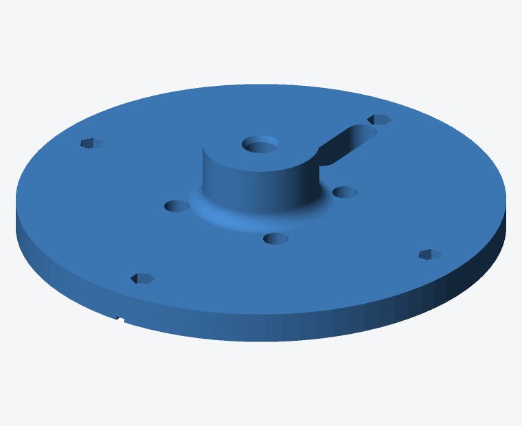

Voir [`printing.md`](printing.md) § « Pose de l'insert ». À faire maintenant :
le bossage est encore accessible de partout.

Contrôle : visser une vis 1/4"-20 à la main, elle doit entrer d'équerre et sans
point dur.

## Étape 3 — Moteur sur le plateau

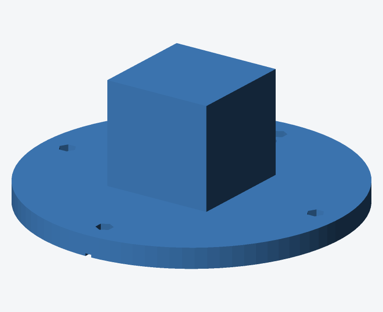

1. Poser le plateau **à l'envers** sur l'établi.
2. Présenter le NEMA 17, arbre vers le haut, bossage de centrage engagé dans
   son dégagement.
3. Orienter la sortie de câble vers le repère gravé (azimut 0°, côté
   passe-câble).
4. Visser **par le dessous** : vis à travers le plateau et la bride du moteur,
   **écrou M3** côté moteur (les 17HS4401 courants ont des **trous traversants**,
   pas de taraudage — les vis fournies avec le moteur conviennent).
5. Serrer en croix, sans forcer.

Contrôle : l'arbre doit tourner librement, sans point dur, et le moteur ne doit
pas basculer.

## Étape 4 — Roulements dans la colonne

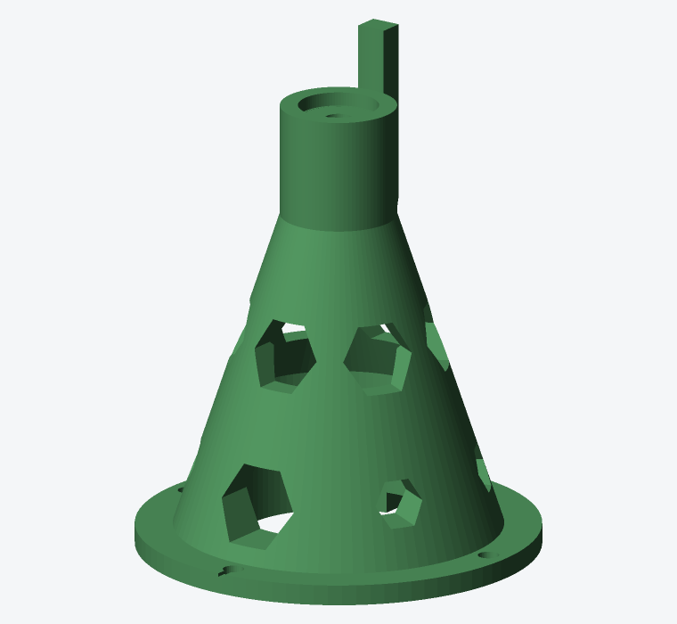

Les deux roulements s'insèrent **par le haut**.

1. Poser la colonne verticalement, bride en bas.
2. Engager le premier 608ZZ dans le col. Il traverse librement le dégagement
   Ø23,5 puis rencontre son logement à z 82.
3. Le pousser **d'équerre** jusqu'à ce qu'il porte sur l'épaulement. Utiliser
   un tube ou une douille de Ø ≈ 21 mm ; ne jamais appuyer sur la bague
   intérieure.
4. Insérer le second 608ZZ, qui s'arrête dans son logement à z 122.

Contrôle : les deux roulements doivent être bien perpendiculaires à l'axe. Une
tige Ø8 passée à travers les deux doit coulisser librement, sans point dur —
c'est le test décisif de la coaxialité.

> Si la tige coince, les roulements ne sont pas d'équerre. Les ressortir et
> recommencer : ce défaut se traduirait par un point dur à chaque tour et par
> des pas perdus.

## Étape 5 — Accouplement

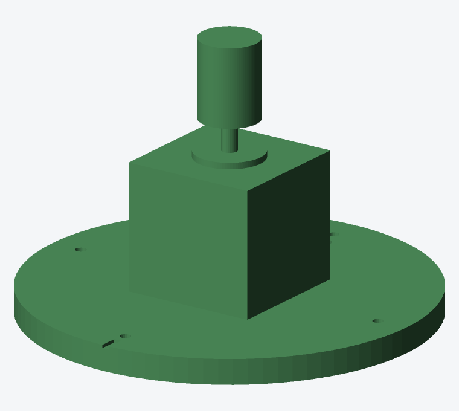

1. Glisser l'accouplement sur l'arbre du moteur, engagé sur **12 mm**.
2. Ne pas encore serrer les vis.
3. Positionner le haut de l'accouplement à z 77.

## Étape 6 — Colonne sur le plateau

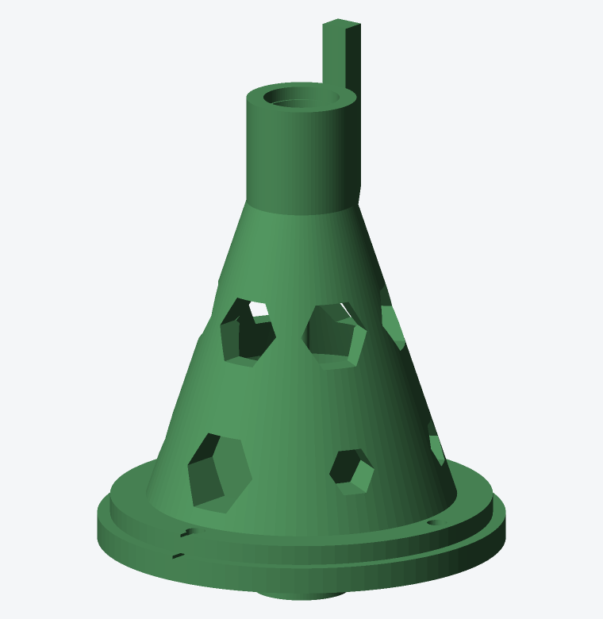

1. Faire descendre la colonne sur le moteur, en la présentant bien droite.
2. Faire passer le câble moteur par l'encoche de bride et la lumière du
   plateau.
3. Aligner les 4 trous de fixation.
4. Visser les M3×20 par le haut, écrous dans les empreintes sous le plateau.
5. Serrer en croix, progressivement.

Contrôle : la bride doit reposer à plat, sans jeu de basculement.

## Étape 7 — Tige et accouplement

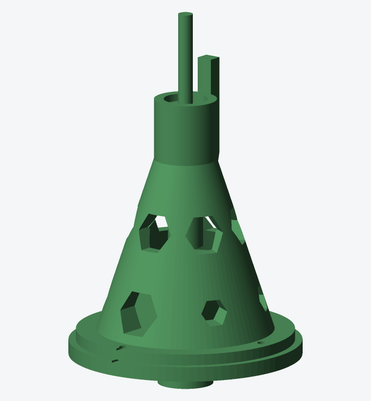

1. Introduire la tige par le haut, à travers les deux roulements.
2. La descendre jusqu'à l'engager de 12 mm dans l'accouplement (elle affleure
   alors z 65 en bas, z 180 en haut).
3. Par les **trois fenêtres hexagonales** de la colonne, serrer les vis de
   l'accouplement côté moteur puis côté tige.
4. Vérifier au pied à coulisse que la tige dépasse bien de 47 mm au-dessus du
   sommet de la colonne.

Contrôle : faire tourner la tige à la main. Elle doit tourner régulièrement,
sans point dur ni jeu radial perceptible. Le moteur non alimenté oppose une
résistance de détente : c'est normal.

> C'est la dernière occasion d'accéder à l'accouplement.

## Étape 8 — STL-19P sur le berceau

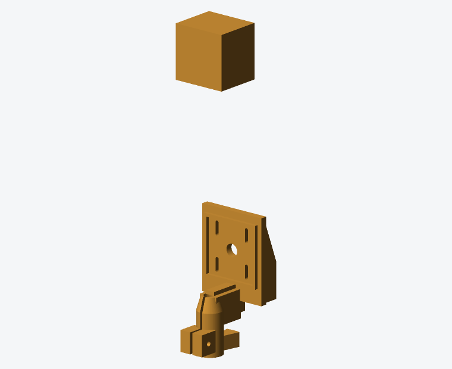

1. **Relever au pied à coulisse la hauteur du plan optique** du STL-19P par
   rapport à sa face de fixation. Valeur supposée : 22 mm. Voir
   [`calibration.md`](calibration.md) § 1.
2. Si l'écart dépasse 2 mm, corriger `lidar_optical_offset` dans `params.scad`
   et réimprimer le berceau. Sinon, rattraper par les lumières oblongues.
3. Poser le STL-19P dans le rebord de centrage, **câble / nappe vers le bas**
   (fente **16 mm** ouverte en bas, à travers la platine).
4. Visser les **3 M2,5** dans les oreilles (latérales + haute, loin du câble).
5. Centrer le plan optique sur la hauteur cible, puis serrer.
6. Passer le câble par le trou central de la platine.

## Étape 9 — Berceau sur la tige

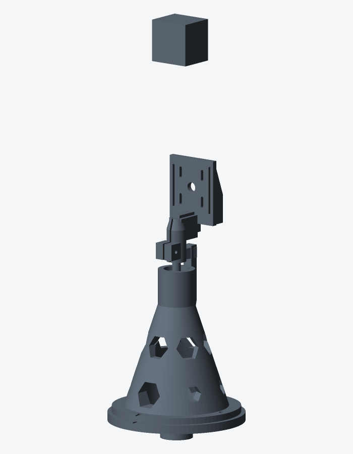

1. Enfiler le moyeu du berceau sur la tige, jusqu'à ce qu'il porte sur la bague
   intérieure du roulement supérieur.
2. Orienter le secteur de butée en regard du contrefort de la colonne.
3. Serrer la vis M3×25 du collier, progressivement.

Contrôle : la tête complète doit tourner d'un bloc, sans jeu entre le berceau
et la tige. En butée, le secteur doit rencontrer franchement le contrefort.

## Étape 10 — Électronique

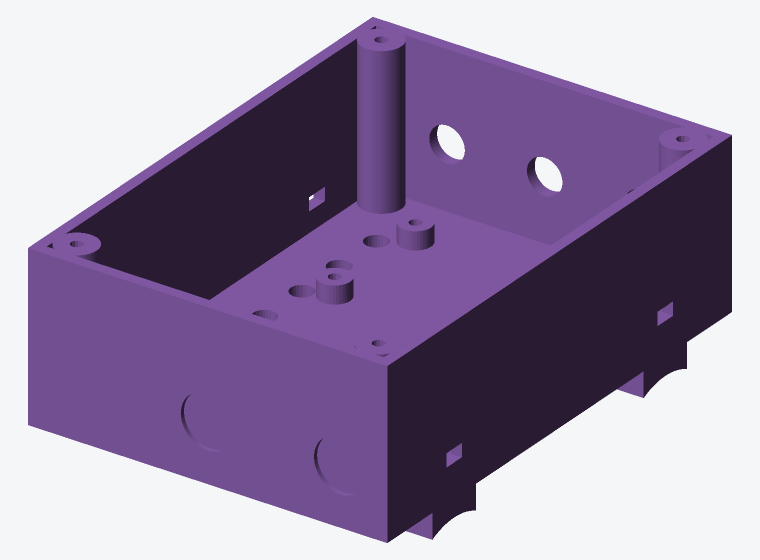

Câbler **hors tension**, en suivant [`wiring.md`](wiring.md).

1. Disposer les modules dans le boîtier : ESP32-S3 côté USB, TMC2209 avec son
   dissipateur, buck et trigger PD à l'opposé.
2. Fixer par vis autotaraudeuses dans les bossages, ou par rilsan.
3. Coller le MPU6050 **à plat au fond**, face parallèle au plateau.
4. Souder la résistance de 1 kΩ sur la ligne TX vers **PDN** (pas USART).
   Souder un fil sur la pastille **DIAG** (triangle près de RP1) vers GPIO 16.
5. Mesurer les tensions du trigger PD (12 V) et du buck (5 V) **avant** de les
   relier aux consommateurs.
6. Fermer le couvercle, 4 vis M3×8.
7. Sangler le boîtier sur la colonne centrale du trépied par rilsan.

## Étape 11 — Câble du LiDAR

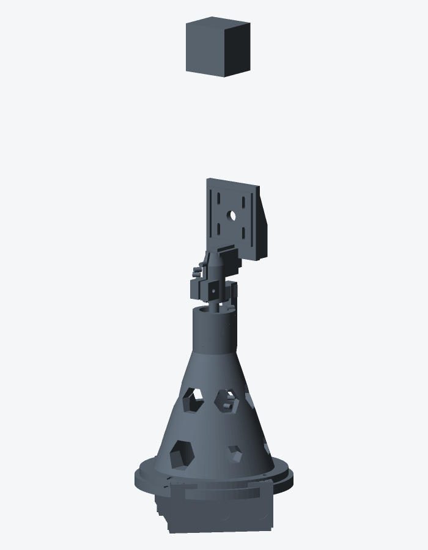

1. Descendre le câble le long de la colonne, en hélice lâche.
2. Laisser **120 mm de mou**.
3. Fixer par rilsan sur le berceau et en bas de la colonne, jamais en tension.
4. Faire tourner la tête à la main sur ±90° : le câble doit suivre librement,
   sans jamais tirer ni frotter sur une arête.

## Étape 12 — Premières mises sous tension

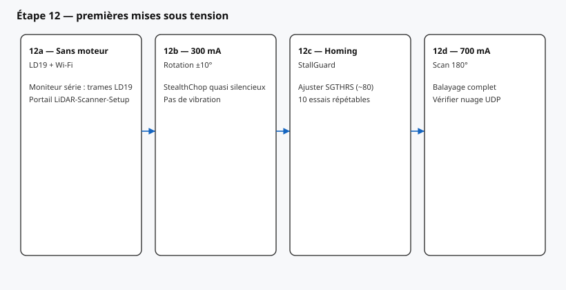

Dans cet ordre, sans jamais brûler d'étape.

**12a — Sans le moteur.** Alimenter, vérifier au moniteur série que le STL-19P
émet des trames valides et que le portail Wi-Fi apparaît. Configurer le réseau.

**12b — Moteur à faible courant.** Régler 300 mA, faire tourner de 10° dans les
deux sens. Écouter : le balayage doit être quasi silencieux en StealthChop.

**12c — Prise de référence.** Lancer le homing StallGuard. Ajuster `SGTHRS`
jusqu'à une détection franche et répétable sur dix essais.

**12d — Scan complet.** Passer à 700 mA et lancer un balayage de 180°.

## Contrôle final

- [ ] La tête tourne librement sur 180°, sans point dur
- [ ] Aucun câble en tension ni frottant
- [ ] Le plan de balayage du STL-19P contient bien l'axe de rotation
- [ ] Le homing est répétable à mieux que 0,5° sur dix essais
- [ ] Le trépied est stable, le scanner ne bascule pas en rotation
- [ ] Aucun échauffement anormal après 5 min de fonctionnement

Passer ensuite à [`calibration.md`](calibration.md).
