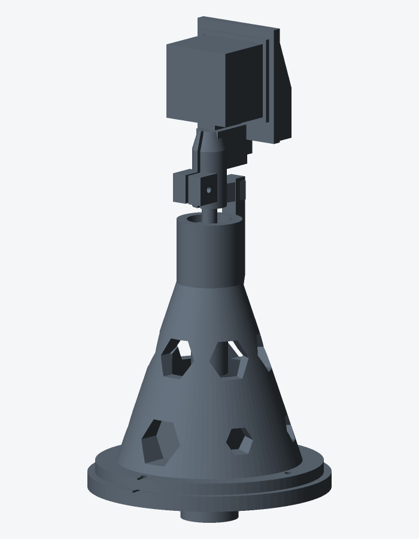

# Guide de construction pas à pas

Parcours complet, de la commande des pièces au premier nuage de points.
Chaque étape renvoie aux fiches détaillées ; ce document fixe **l’ordre** et
les contrôles de passage.

Durée indicative (hors délais de livraison) :

| Phase | Temps |
|---|---|
| Commandes + impression | 1–2 jours (dont ~9 h d’impression) |
| Montage mécanique | ~3 h |
| Câblage + firmware | ~2–3 h |
| Premier scan + calibration | ~2 h |
| **Total atelier** | **environ 1 week-end** |



---

## Vue d’ensemble

```
 0. Lire le principe
 1. Vérifier / compléter le BOM
 2. Préparer le PC hôte (sans matériel)
 3. Imprimer (coupon → pièces)
 4. Monter la mécanique
 5. Câbler et alimenter
 6. Flasher le firmware
 7. Configurer Wi‑Fi + panneau web
 8. Premier scan d’essai
 9. Calibrer
10. Scans réels + post-traitement
```

Ne pas sauter l’ordre : plusieurs opérations (insert trépied, Vref TMC, flash
USB initial) deviennent pénibles une fois le boîtier fermé ou la tête montée.

---

## Étape 0 — Comprendre le principe (30 min)

Lire, dans cet ordre :

1. [README.md](../README.md) — vue d’ensemble  
2. [geometry.md](geometry.md) — pourquoi le LiDAR est sur la tranche (STL-19P),
   et pourquoi
   θ = élévation / ψ = azimut  
3. [architecture.md](architecture.md) — qui fait quoi (ESP32 vs PC)

**Contrôle.** Tu dois pouvoir expliquer en une phrase : *le LiDAR balaie un
plan vertical ; le moteur tourne ce plan de 180° ; l’ESP32 envoie du polaire ;
le PC fait le XYZ.*

---

## Étape 1 — Matériel (commande)

### 1.1 Inventaire

Ouvrir [bom.md](bom.md) et cocher, section par section :

**A — Déjà commandé**

- [ ] A1 STL-19P (FHL-LD19P)
- [ ] A2 ESP32-S3 DevKitC-1 **N16R8**
- [ ] A3 Driver TMC2209
- [ ] A4 Moteur NEMA 17 **pas à pas 4 fils** (pas de BLDC brushless)
- [ ] A5 MPU6050
- [ ] A6 Roulements 608ZZ (×2 min.)
- [ ] A7 Insert laiton 1/4"-20 UNC **× 10 × 8 mm**
- [ ] A8 Trigger USB-C PD
- [ ] A9 Buck 12 V → 5 V 3 A
- [ ] A10 Power bank USB-C PD

**B — À acquérir**

- [ ] B1 Tige Ø8 (≥ 120 mm, à recouper à 115 mm)
- [ ] B2 Accouplement flexible 5 → 8 mm
- [ ] B3–B7 Visserie M3 / M2,5 (voir [bom.md](bom.md))
- [ ] B8 Colliers rilsan
- [ ] B9 Fil silicone AWG24–26
- [ ] B10 Niveau à bulle (optionnel)

**C — Pièces imprimées** (réalisées à l’[étape 3](#étape-3--impression-3d), pas à acheter)

- [ ] C0 `test_fits` (coupon — en premier)
- [ ] C1 `base_plate`
- [ ] C2 `bearing_tower`
- [ ] C3 `lidar_cradle`
- [ ] C4 `electronics_box`
- [ ] C5 `electronics_lid`

**D — Outillage**

- [ ] Imprimante 3D (volume ≥ 130 × 130 × 140 mm)
- [ ] Fer à souder (pose insert)
- [ ] Pied à coulisse
- [ ] Multimètre
- [ ] Clés Allen 1,5 / 2 / 2,5 mm
- [ ] Scie à métaux ou Dremel (recoupe tige)

**E — Vigilance achat** : relire [bom.md](bom.md) § E (variante STL-19P, moteur
pas à pas, N16R8, accouplement flexible).

### 1.2 Points critiques à l’achat

| Pièce | Vigilance |
|---|---|
| ESP32-S3 | Variante **N16R8** (16 Mo flash / 8 Mo PSRAM) |
| Moteur | **Pas à pas 4 fils** NEMA 17 (STEP/DIR) — pas de BLDC 42BL3802 |
| Accouplement | **Flexible** 5→8 mm, pas rigide |
| Tige | Acier rectifié Ø8, à recouper à **115 mm** |
| LiDAR | **STL-19P** : 3 oreilles M2,5, 5 000 Hz, détection verre |

**Contrôle.** Toute la section **B** est chez toi avant le montage final.
La section **C** se coche au fur et à mesure des impressions. On peut
imprimer en attendant la fin des livraisons A/B.

---

## Étape 2 — Station hôte sur le PC (sans scanner)

À faire **pendant** que les colis et les impressions arrivent.

```bash
cd host
python -m venv .venv
source .venv/bin/activate          # Windows : .venv\Scripts\activate
pip install -e ".[dev]"
pytest -q                          # 39 tests attendus
```

Sous WSL2, pour Open3D :

```bash
export DISPLAY=:0                  # WSLg
```

Valider le pipeline avec le simulateur (deux terminaux) :

```bash
# A
lidar-visualize --port 9000

# B
lidar-simulate --host 127.0.0.1 --port 9000 --fast
```

Sans fenêtre : `lidar-receive --port 9000 --output scans/sim.pcd --auto-stop`.

Détails : [open3d.md](open3d.md), [host/README.md](../host/README.md).

**Contrôle.** Tu vois une pièce synthétique aux murs plans, ou un `.pcd` non
vide. Si ce n’est pas le cas, corriger l’hôte **avant** de toucher au matériel.

---

## Étape 3 — Impression 3D

Fiche détaillée : [printing.md](printing.md). STL : `mechanical/stl/`.

### 3.1 Coupon de calibration (obligatoire en premier)

1. Imprimer `test_fits.stl` (PETG, 0,2 mm, 3 périmètres, 20 %).  
2. Tester les logements de roulement et les trous d’insert.  
3. Reporter les jeux dans `mechanical/openscad/params.scad` si besoin.  
4. Régénérer : `cd mechanical/openscad && make`.

**Contrôle.** Un 608ZZ s’enfonce ferme d’équerre ; l’insert 1/4"-20 se pose
sans fendre le bossage.

### 3.2 Pièces structurelles

Ordre recommandé :

| # | Fichier | Remarques |
|---|---|---|
| 1 | `base_plate` | Imprimée **retournée** |
| 2 | `bearing_tower` | 5 périmètres, 40 % — pièce critique |
| 3 | `lidar_cradle` | Imprimée **couchée** |
| 4 | `electronics_box` + `electronics_lid` | |

Environ 9 h / 220 g PETG au total.

**Contrôle.** Toutes les pièces ébavurées ; colonnette et lamages propres ;
aucun stringing dans les logements de roulement.

---

## Étape 4 — Montage mécanique

Fiche détaillée : [assembly.md](assembly.md). Conception : [mechanical.md](mechanical.md).

Suivre **strictement** l’ordre du guide de montage. Résumé :

| # | Action | Contrôle |
|---|---|---|
| 1 | Recouper la tige à **115 mm**, ébavurer | Longueur exacte |
| 2 | Pose à chaud de l’insert 1/4"-20 dans le plateau | Vis trépied d’équerre |
| 3 | NEMA 17 sous le plateau (4× M3 + écrou M3) | Arbre libre, moteur stable |
| 4 | Deux 608ZZ dans la colonne (par le haut) | Portage sur épaulements |
| 5 | Colonne sur plateau (4× M3×20) | Bride à plat, pas de jeu |
| 6 | Accouplement flexible 5→8 | Vis serrées, pas de contrainte |
| 7 | Tige dans les roulements + accouplement | Tourne libre, sans frottement |
| 8 | Berceau + STL-19P sur la tige | Plan optique vertical, 3× M2,5, serrage M3 |
| 9 | Boîtier électronique (sans fermer le couvercle) | Sanglage trépied plus tard |

**Contrôle final mécanique.**

- [ ] La tête tourne à la main sur ~180° jusqu’à la butée  
- [ ] Aucun frottement câble / colonne  
- [ ] Le STL-19P ne touche pas la colonne ni le plateau  
- [ ] Le trépied reçoit bien le plateau (test à blanc)

---

## Étape 5 — Câblage et alimentation

Fiche et **plans SVG** : [wiring.md](wiring.md)
([ensemble](wiring/01_ensemble.svg),
[alimentation](wiring/02_alimentation.svg),
[signaux](wiring/03_signaux.svg),
[brochage](wiring/04_brochage.svg)).

### 5.1 Alimentation (hors ESP32 d’abord)

1. Power bank → trigger USB-C PD réglé sur **12 V**.  
2. 12 V → entrée TMC2209 (VM) **et** entrée du buck.  
3. Buck réglé / vérifié à **5,0 V** à vide.  
4. Mesurer au multimètre **avant** de brancher ESP32 / LD19.

**Contrôle.** 12 V ±5 % sur le rail moteur ; 5,0 V ±0,1 V sur le rail logique.

### 5.2 Signaux

Suivre le tableau de [wiring.md](wiring.md) (GPIO S3) :

| Fonction | Broches typiques |
|---|---|
| LD19 UART RX + PWM | GPIO 18, 17 |
| TMC STEP / DIR / EN | GPIO 4, 5, 6 |
| TMC UART | GPIO 7, 15 (+ DIAG 16) |
| MPU6050 I2C | GPIO 8, 9 |
| Wi‑Fi reset | BOOT (GPIO 0) |

Rappels :

- MPU6050 en **3,3 V**, pas 5 V  
- Résistance 1 kΩ sur la ligne UART TMC si le module le demande  
- Ne **jamais** utiliser GPIO 33–37 sur le N16R8 (PSRAM)

### 5.3 Courant TMC2209 (Vref)

Régler le potentiomètre selon [wiring.md](wiring.md) pour viser ~700 mA RMS
en scan (formule / table du doc). StealthChop via UART sera peaufiné au flash.

**Contrôle.** Multimètre sur Vref ; driver froid à l’arrêt ; pas d’odeur de
brûlé au premier essai moteur.

---

## Étape 6 — Firmware

Fiche : [firmware/README.md](../firmware/README.md).

### 6.1 Premier flash **obligatoirement en USB** — amorce OTA

On flashe d'abord l'amorce : Wi-Fi + OTA firmware + OTA LittleFS, rien
d'autre. Une fois le réseau configuré, le câble USB n'est plus nécessaire.

```bash
cd firmware
pio run -e seed -t upload
pio device monitor
```

Attendu sur le moniteur :

```
[lidar-scanner] amorce OTA 0.1.0-seed
[wifi] …
[seed] http://lidar-scanner.local/ …
```

Configurer le Wi-Fi via `LiDAR-Scanner-Setup`, puis ouvrir
`http://lidar-scanner.local/`. Les mises à jour suivantes : [ota.md](ota.md)
(`pio run -e ota -t upload` / `-t uploadfs`, ou la page web).

**Contrôle.** Flash OK, pas de reboot en boucle, page d'amorce joignable
en HTTP, OTA firmware et filesystem acceptés.

---

## Étape 7 — Wi‑Fi et panneau web

Fiches : [wifi.md](wifi.md), [web.md](web.md).

1. Au premier boot (ou après BOOT maintenu) : se connecter à l’AP
   `LiDAR-Scanner-Setup`.  
2. Renseigner SSID, mot de passe, **IP du PC hôte**, mot de passe OTA.  
3. L’ESP redémarre sur le Wi‑Fi local.  
4. Ouvrir `http://lidar-scanner.local/` (ou l’IP affichée au moniteur).  
5. S’authentifier : `admin` / mot de passe OTA.

Sur le panneau, sans lancer de long scan :

- [ ] Diagnostics : état `idle`, heap raisonnable, RSSI visible
- [ ] Réglages : valeurs par défaut présentes
- [ ] Bouton **Rehomer** : la tête trouve la butée (ajuster StallGuard si besoin)
- [ ] **Arrêt d'urgence** : moteur se coupe

**Contrôle.** Homing fiable ; page web stable ; l’IP hôte dans le portail est
bien celle du PC qui écoutera le port UDP 9000.

---

## Étape 8 — Premier scan d’essai

Fiches : [operation.md](operation.md), [open3d.md](open3d.md).

### 8.1 Préparer la scène

- Pièce peu meublée, **volets fermés**, miroirs couverts  
- Scanner sur trépied, à ~1,5 m, de niveau (bulle)  
- Power bank pleine, boîtier sanglé sur la colonne du trépied  

### 8.2 PC hôte

```bash
cd host && source .venv/bin/activate
lidar-visualize --port 9000
# ou enregistrement :
# lidar-receive --port 9000 --output scans/essai1.pcd --auto-stop
```

### 8.3 Lancer le balayage

Sur le panneau web : **Lancer le scan**.

Surveiller :

| Symptôme | Action |
|---|---|
| Nuage vide | IP hôte / même LAN / pare-feu UDP 9000 |
| Murs courbes | Normal tant que non calibré — noter pour l’étape 9 |
| Homing raté | Monter / baisser seuil StallGuard sur le panneau |
| Vibrations | Courant trop haut / StealthChop / sol instable |
| CRC mauvais | Câble UART LD19, masse, 5 V |

**Contrôle.** Au moins quelques dizaines de milliers de points ; un `.pcd`
enregistré ; fin de scan signalée (`--auto-stop` ou fenêtre fermée proprement).

---

## Étape 9 — Calibration

Fiche : [calibration.md](calibration.md). Fichier :
`host/calibration.json`.

Mesures à faire **une fois** (puis itérer) :

1. Bras de levier (pied à coulisse) → `lever_arm_mm`  
2. Offset azimut ψ  
3. Offset élévation θ  
4. Nivellement (`g_zero` — IMU quand le code sera branché, sinon bulle +
   approximation)  
5. Filtres `rho_min` / intensité  

Rescanner une position de contrôle après chaque correction majeure.

**Contrôle.** Murs plans, angles droits, sol horizontal dans Open3D.

---

## Étape 10 — Usage courant

1. Préparer les lieux ([operation.md](operation.md))  
2. `lidar-receive` ou `lidar-visualize`  
3. Lancer le scan depuis le web  
4. Repositionner (30 % de recouvrement) pour les angles morts / nadir  
5. Fusionner :  
   `lidar-register scans/salon_*.pcd --output salon.pcd`  
6. Mailler :  
   `lidar-mesh salon.pcd --output salon.ply --depth 8`  

OTA pour les évolutions firmware : [ota.md](ota.md).  
Réglages fins (StallGuard, courants, vitesse) : [web.md](web.md).

---

## Checklist « prototype terminé »

- [ ] BOM A+B complet  
- [ ] Coupon `test_fits` validé, pièces imprimées  
- [ ] Mécanique montée, rotation libre jusqu’à butée  
- [ ] 12 V / 5 V mesurés, Vref TMC réglé  
- [ ] Amorce `seed` flashée USB, page OTA joignable  
- [ ] Homing StallGuard fiable  
- [ ] Au moins un `.pcd` réel enregistré  
- [ ] `calibration.json` renseigné (même approximatif)  
- [ ] Un second scan + `lidar-register` réussis  

---

## En cas de blocage

| Étape | Doc dépannage |
|---|---|
| Impression / jeux | [printing.md](printing.md) |
| Montage | [assembly.md](assembly.md) |
| Alim / GPIO | [wiring.md](wiring.md) |
| Wi‑Fi | [wifi.md](wifi.md) |
| Web / OTA | [web.md](web.md), [ota.md](ota.md) |
| Nuage / Open3D | [open3d.md](open3d.md), [operation.md](operation.md) |
| Géométrie douteuse | [geometry.md](geometry.md), [calibration.md](calibration.md) |

---

## Index des documents

| Document | Rôle |
|---|---|
| **Ce guide** | Ordre de construction |
| [bom.md](bom.md) | Nomenclature |
| [printing.md](printing.md) | Impression |
| [mechanical.md](mechanical.md) | Conception mécanique |
| [assembly.md](assembly.md) | Montage détaillé |
| [wiring.md](wiring.md) | Électrique |
| [wifi.md](wifi.md) / [web.md](web.md) / [ota.md](ota.md) | Réseau & IHM |
| [calibration.md](calibration.md) | Mesures de calage |
| [operation.md](operation.md) | Conduite des scans |
| [open3d.md](open3d.md) | Visualisation & mesh |
| [geometry.md](geometry.md) | Maths |
| [architecture.md](architecture.md) | Logiciel |
