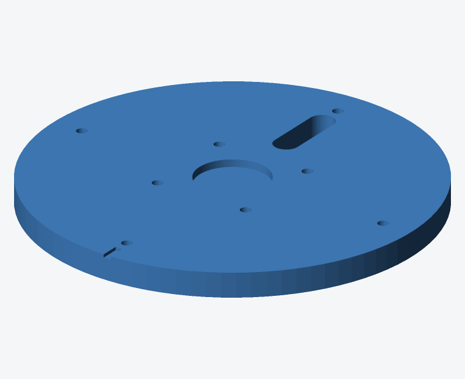
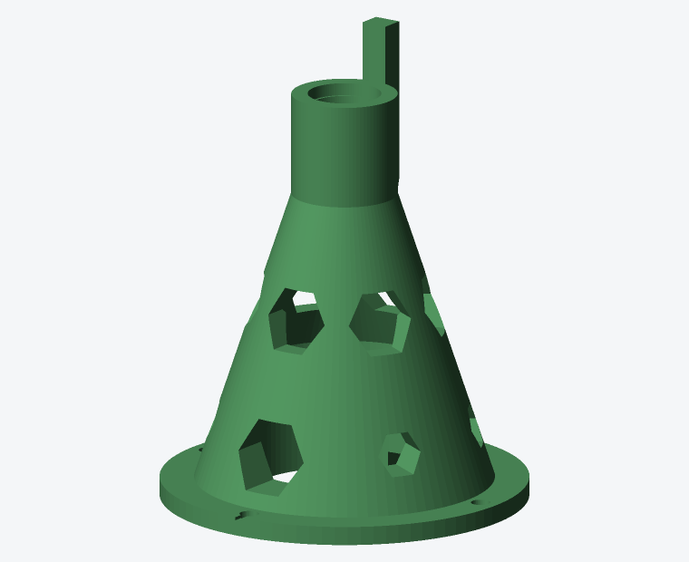
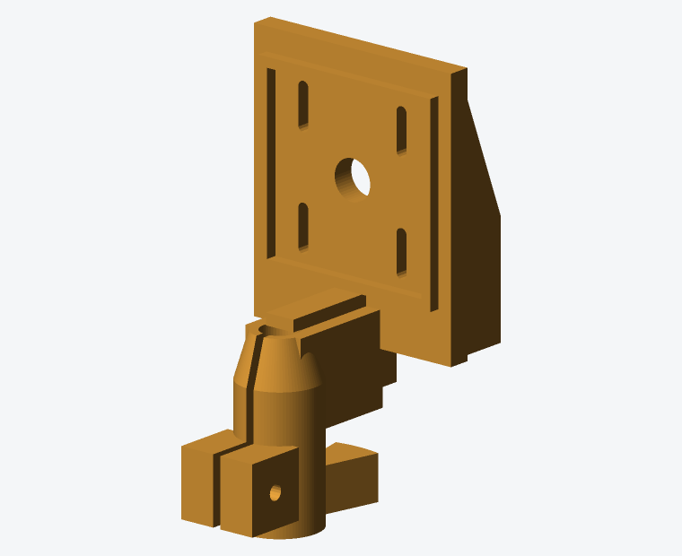
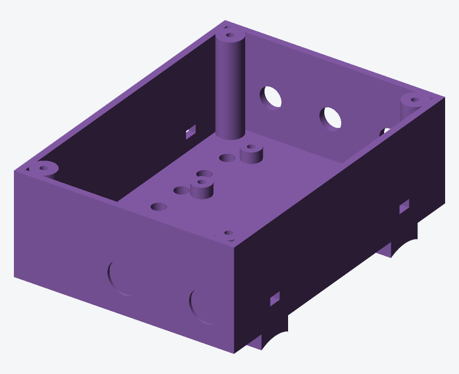

# Conception mécanique

Toutes les cotes sont en millimètres. Le repère d'assemblage a son origine
$z = 0$ sur la **face supérieure du plateau de base**, l'axe $Z$ confondu avec
l'axe de rotation (lacet).


## 1. Chaîne cinématique

```
                    LD19 (couché, plan de balayage vertical)
                       │  centre optique : z = 205, sur l'axe
                  ┌────┴────┐
                  │ berceau │  C3 — serre sur la tige
                  └────┬────┘
                       │  tige acier Ø8, z 65 → 180
                  ┌────┴────┐
                  │ 608ZZ   │  z 122 (palier de butée : reprend le poids)
                  │ colonne │  C2
                  │ 608ZZ   │  z 82  (palier de guidage)
                  └────┬────┘
                       │  accouplement flexible 5→8, z 52 → 77
                  ┌────┴────┐
                  │ NEMA 17 │  z 0 → 40
                  └────┬────┘
                  ┌────┴────┐
                  │ plateau │  C1
                  └────┬────┘
                       │  insert 1/4"-20
                    trépied
```

Hauteur totale au-dessus de la semelle du trépied : **229 mm**.
Masse de la tête tournante : environ 110 g (LD19 47 g + berceau 45 g + tige).

## 2. Décisions de conception

### Entraînement direct plutôt que courroie

Le TMC2209 en 1/16 de pas donne $360 / (200 \times 16) = 0{,}1125°$ par
micro-pas, soit 3,5 fois plus fin que le pas de balayage visé (0,4°). Une
réduction par courroie n'apporterait donc aucune résolution utile, tout en
introduisant du jeu et une pièce d'usure supplémentaire. L'entraînement direct
supprime totalement le jeu de renversement.

### Moteur au-dessus du plateau, coaxial

L'axe de rotation et la vis de trépied doivent tous deux passer par le centre.
Le conflit se résout en plaçant le moteur **sur** le plateau (arbre vers le
haut) et l'insert 1/4"-20 **sous** le plateau, dans un bossage. La colonne
coiffe alors le moteur.

### Accouplement flexible, pas rigide

Deux roulements sur une tige rigide plus un accouplement rigide vers le moteur
forment un système hyperstatique : le moindre défaut d'alignement précontraint
les roulements et crée un point dur. Un accouplement à mâchoires absorbe ce
défaut.

### Palier de butée en haut

Le roulement supérieur (z 122) reprend la charge axiale : le moyeu du berceau
prend appui sur sa bague intérieure. Le chemin d'effort est donc
LiDAR → berceau → bague intérieure → billes → bague extérieure → épaulement de
la colonne → plateau → trépied. Le roulement inférieur (z 82) ne travaille
qu'en radial.

## 3. Occultation au nadir

Tout ce qui se trouve sous le LiDAR et sur l'axe se trouve **dans** le plan de
balayage et masque une portion de la sphère autour du nadir.

| Élément | Ø | Distance sous le centre optique | Demi-angle masqué |
|---|---|---|---|
| Sommet du moyeu | 12 | 25 | 13,5° |
| Voile du berceau | 14 (en Y) | 25 | 15,6° |
| Sommet de la colonne | 34 | 72 | 13,3° |
| Contrefort de butée | 48 (local) | 53 | 24° sur un seul azimut |

Le cône aveugle fait donc environ **20° de demi-angle**, plus un secteur
étroit à l'azimut du contrefort. Sur un trépied à 1,50 m, cela correspond à un
disque de sol d'environ 0,55 m de rayon autour des pieds — que l'on comble
depuis une seconde position de scan. Un scanner terrestre professionnel perd
exactement la même zone.

La platine du berceau, elle, est parallèle au plan de balayage et décalée de
22 mm : deux plans parallèles ne se coupent jamais, elle n'occulte donc rien.

## 4. Cotes principales

### C1 — Plateau de base



| Cote | Valeur |
|---|---|
| Diamètre | 126 |
| Épaisseur | 8 |
| Bossage trépied | Ø30 × 16 vers le bas |
| Logement d'insert | Ø8,4 × 13, par le dessous |
| Fixation moteur | 4 × M3, carré 31, têtes noyées par le dessous |
| Fixation colonne | 4 × M3 sur Ø106, écrous noyés par le dessous |
| Passage de câbles | Lumière 18 × 8 à 180° |

Les têtes de vis du moteur sont noyées sous le plateau pour ne pas gêner la
semelle de trépied.

### C2 — Colonne à roulements



| Cote | Valeur |
|---|---|
| Bride | Ø118 × 6 |
| Base du cône | Ø96 |
| Col | Ø34 |
| Hauteur totale | 133 |
| Cavité moteur | Ø62 jusqu'à z 42 |
| Gorge d'accouplement | Ø26 |
| Logement roulement bas | Ø21,9 × 7 à z 82 |
| Dégagement intermédiaire | Ø23,5 |
| Logement roulement haut | Ø21,9 × 7 à z 122 |

Les trois fenêtres hexagonales à z 64 donnent accès **aux vis de
l'accouplement**, inaccessibles une fois la colonne posée. Elles ne sont pas
décoratives.

Le contrefort dorsal sert de **butée mécanique** pour la prise de référence
d'azimut par StallGuard, sans capteur.

### C3 — Berceau LiDAR



| Cote | Valeur |
|---|---|
| Moyeu | Ø18, serrage sur 40 mm de tige, rétreint à Ø12 en tête |
| Fente de serrage | 1,8 mm + vis M3×25 |
| Platine | 5 mm d'épaisseur, à x = −22 (= décalage optique) |
| Fixation LD19 | 4 lumières oblongues de 8 mm, carré 24,9 |
| Rebord de centrage | 38,6 × 38,6, hauteur 2,5 |
| Secteur de butée | 26° sur Ø48 |

Les lumières oblongues sont **volontaires** : le pattern de perçage exact du
LD19 doit être relevé sur l'exemplaire réel, et le réglage fin en hauteur du
centre optique se fait par glissement.

### C4/C5 — Boîtier électronique



Volume intérieur 106 × 76 × 34. Il se **sangle sur la colonne centrale du
trépied** par deux berceaux en Ø32 sous le fond. L'électronique reste ainsi au
sol : la tête tournante ne porte que le LiDAR et son câble, et le trépied
n'est pas déséquilibré par une masse en porte-à-faux.

## 5. Contraintes de non-collision vérifiées

Ces contraintes sont vérifiées géométriquement dans les sources OpenSCAD et
ont été validées par rendu.

| Contrainte | Marge |
|---|---|
| Sommet de la tige (z 180) sous le corps du LD19 (z 185,7) | 5,7 mm |
| Voile du berceau (z ≤ 180) sous le LD19 | 5,7 mm |
| Cavité de la colonne Ø62 / diagonale NEMA 17 Ø59,8 | 1,1 mm au rayon |
| Paroi de la colonne au droit de la cavité | 4,2 mm mini |
| Vis de colonne (R 53) hors du cône (R 48) | 5 mm, têtes accessibles |
| Nervures dorsales du berceau côté −X | hors volume LiDAR |

**La tige ne doit pas dépasser 115 mm** : au-delà elle pénètre dans le corps
du LD19.

## 6. Matériau et rigidité

Le **PETG** est recommandé : il est plus rigide et bien plus stable
dimensionnellement que le PLA dans une voiture ou un local chaud, et moins
capricieux que l'ABS. Le PLA reste acceptable pour un premier prototype à
condition de ne jamais laisser le scanner au soleil.

Points de rigidité structurants :

- La **colonne** détermine la précision angulaire : 5 périmètres et 40 % de
  remplissage, sans exception.
- L'entraxe des deux roulements (40 mm) fixe la rigidité en basculement. Le
  réduire dégraderait directement la précision.
- Le **moyeu du berceau** serre sur 40 mm de tige, ce qui suffit largement pour
  110 g en porte-à-faux de 40 mm.

## 7. Génération des pièces

```bash
cd mechanical/openscad
make                # STL dans ../stl/
make renders        # aperçus PNG (nécessite un contexte OpenGL)
```

Sans serveur graphique, utiliser le rasteriseur en Python pur du dépôt :

```bash
cd mechanical
OPENSCAD=/chemin/vers/openscad ./tools/render_all.sh
```

Tous les paramètres sont centralisés dans
[`params.scad`](../mechanical/openscad/params.scad). Modifier une cote et
relancer `make` propage le changement à toutes les pièces.
