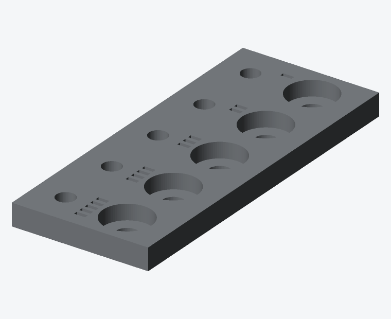

# Impression 3D

## Réglages généraux

| Paramètre | Valeur | Motif |
|---|---|---|
| Matériau | PETG | Rigidité et stabilité dimensionnelle |
| Buse | 0,4 mm | Standard |
| Hauteur de couche | 0,2 mm | Compromis précision / durée |
| Températures | 240 °C / 80 °C | À adapter au filament |
| Refroidissement | 40 % | Trop refroidir fragilise les couches en PETG |
| Rétraction | Selon profil PETG | Le PETG file facilement |

Le PLA convient pour un premier prototype, mais il flue sous contrainte et se
déforme dès 50 °C — proscrit dans une voiture en été.

## Réglages par pièce

| Pièce | Périmètres | Remplissage | Orientation | Supports |
|---|---|---|---|---|
| `test_fits` | **2** | **10 %** | Telle quelle | Non |
| `test_lidar_fit` | **2** | **10 %** | Telle quelle, rebord vers le haut | Non |
| `base_plate` | 4 | 30 % | **Retournée**, bossage vers le haut | Non |
| `bearing_tower` | **5** | **40 %** | Bride sur le plateau | Non |
| `lidar_cradle` | 4 | 35 % | **Couchée**, platine à plat | Sous le moyeu |
| `electronics_box` | 3 | 20 % | Ouverture vers le haut | Non |
| `electronics_lid` | 3 | 20 % | À plat | Non |

Durée totale : environ 9 h, pour 220 g de filament.

### `test_fits` — coupon rapide

Pièce **compacte** (~132 × 44 × 8 mm, logements roulement sur 5 mm).
Viser **20 à 30 min** de plateau :

| Paramètre | Valeur | Motif |
|---|---|---|
| Hauteur de couche | **0,28 mm** | Précision suffisante pour juger un Ø22 |
| Périmètres | **2** | Les perçages définissent l'ajustement, pas les parois |
| Remplissage | **10 %** | Plaque pleine, peu de contrainte mécanique |
| Vitesse | Profil « draft » du slicer | OK pour un coupon jetable |

Ne pas appliquer ces réglages agressifs à `bearing_tower` ni au berceau.

### `test_lidar_fit` — empreinte STL-19P

Coupon plat (~62 × 53 × 7,5 mm) pour valider le capteur **sans réimprimer le berceau**.

```bash
cd mechanical/openscad && make ../stl/test_lidar_fit.stl
```

Même couche 0,28 mm / 2 périmètres / 10 % que `test_fits`. Poser le STL-19P dans le rebord, **nappe vers la fente**. Contrôler : 3 vis M2,5, nappe qui sort, capteur sans forcer.

### `bearing_tower` — la pièce critique

Elle porte les deux roulements et définit à elle seule l'axe de rotation.
Toute souplesse ici se traduit directement en erreur angulaire, donc en erreur
de position dans le nuage. Ne pas réduire les 5 périmètres ni les 40 % de
remplissage.

Le cône se rétrécit vers le haut : aucune surface en surplomb, donc aucun
support. Les fenêtres hexagonales ont un sommet en pointe, auto-portant par
construction.

### `base_plate` — imprimée retournée

En posant la face supérieure sur le plateau, le bossage de trépied pointe vers
le haut et les lamages de vis moteur se retrouvent côté plateau. Résultat :
aucun surplomb, et surtout une **face de référence parfaitement plane** pour le
moteur, ce qui conditionne la perpendicularité de l'axe.

### `lidar_cradle` — couchée

Imprimer avec `rotate([0, -90, 0])`, platine à plat. Les couches sont ainsi
perpendiculaires à l'effort de porte-à-faux du LiDAR. Imprimée debout, la pièce
casserait au raccordement voile / platine.

## Étape obligatoire : calibrer les ajustements

**Imprimer `test_fits` en premier, avant toute autre pièce.**



Le coupon présente cinq logements de roulement (rangée du haut, borgnes, avec
trou d'expulsion) et cinq alésages de tige (rangée du bas, traversants). Chaque
paire est repérée par un nombre d'encoches gravées entre les deux rangées.

| Index | 1 | 2 | 3 | 4 | 5 |
|---|---|---|---|---|---|
| `delta` | −0,05 | 0,00 | +0,05 | +0,10 | +0,15 |
| Logement 608ZZ | 21,95 | 22,00 | 22,05 | 22,10 | 22,15 |
| Alésage tige Ø8 | 8,30 | 8,35 | 8,40 | 8,45 | 8,50 |

La plage est volontairement décalée vers le **large** : beaucoup d'imprimantes
rétrécissent les perçages. Si l'encoche 5 d'un ancien coupon (delta 0,00) était
encore serrée, repartir sur cette version avant d'imprimer la colonne.

Critères :

- **Roulement** : doit entrer à la presse à main ferme, sans jeu perceptible et
  sans faire blanchir ni fissurer la paroi. S'il entre tout seul, c'est trop
  large ; s'il faut un marteau, c'est trop serré. Le trou de Ø10 sous chaque
  logement permet de le ressortir sans l'abîmer.
- **Tige Ø8** : doit coulisser sans point dur, sans jeu radial sensible.

Reporter ensuite dans
[`params.scad`](../mechanical/openscad/params.scad) :

```
fit_press =  0.15;   // delta de l'index retenu pour le roulement
fit_slide =  0.45;   // delta + 0.35 pour l'index retenu pour la tige
```

puis régénérer les STL avec `make`. Une vingtaine de minutes de plateau
(compact + couche 0,28 mm) évitent de rater la colonne, qui demande près de 4 h.

## Pose de l'insert 1/4"-20

Utiliser un insert **1/4"-20 UNC × 10 × 8 mm** (diamètre extérieur Ø8 mm,
longueur 10 mm) — pas un 6×8 trop étroit pour le logement Ø8,4 × 13 mm.

1. Fer à souder à panne large, 230 °C (PETG) ou 210 °C (PLA).
2. Présenter l'insert, filetage vers l'extérieur, dans le logement Ø8,4 du
   bossage, **par le dessous**.
3. Enfoncer lentement et bien d'équerre, en s'aidant du chanfrein d'amorce.
   Compter 15 à 20 s.
4. S'arrêter **affleurant**, jamais en dessous : un insert trop enfoncé
   empêchera la vis de trépied de porter correctement.
5. Laisser refroidir sous une légère pression, à plat sur une surface de
   référence.

Un insert de travers rend le scanner impossible à mettre de niveau. En cas de
doute, le rechauffer et recommencer — le panier contient 50 inserts.

## Vérifications après impression

- [ ] Les deux 608ZZ entrent en force dans la colonne, sans jeu
- [ ] La tige Ø8 coulisse librement dans les deux roulements en place
- [ ] Le NEMA 17 se plaque sans jeu sur le plateau, bossage bien engagé
- [ ] La bride de colonne repose à plat sur le plateau (aucun basculement)
- [ ] L'insert 1/4"-20 est affleurant et d'équerre
- [ ] Le berceau serre fermement sur la tige, sans jeu de rotation
- [ ] Le rebord de centrage (**54 × 46,3 mm**) accueille le STL-19P sans forcer
- [ ] **3** vis M2,5 traversantes (2 à **6,67 mm** du bas / câble, 1 à **42,69 mm**)
- [ ] Encoche câble **traversante** en bas de la platine (fente 16 mm, ouverte vers le bord)
