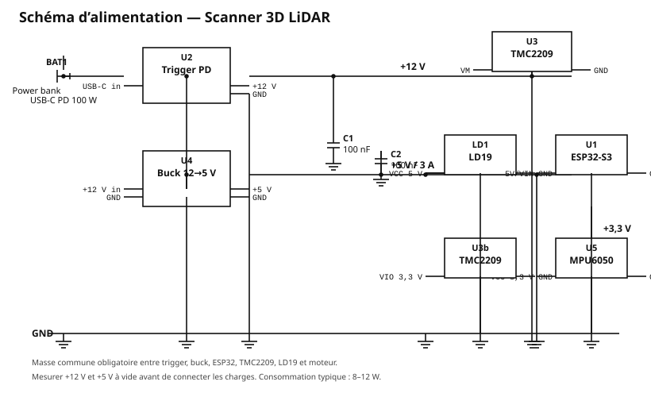
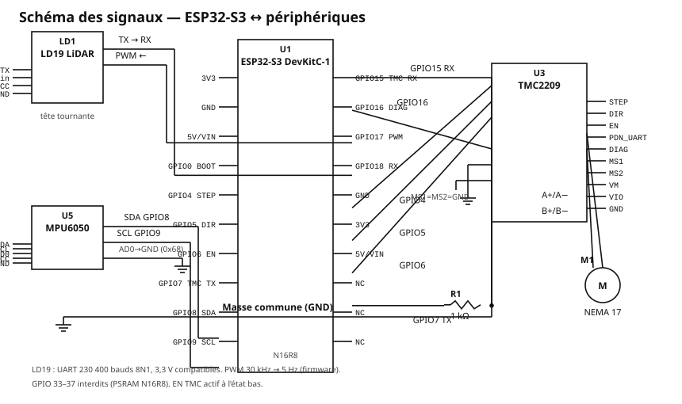
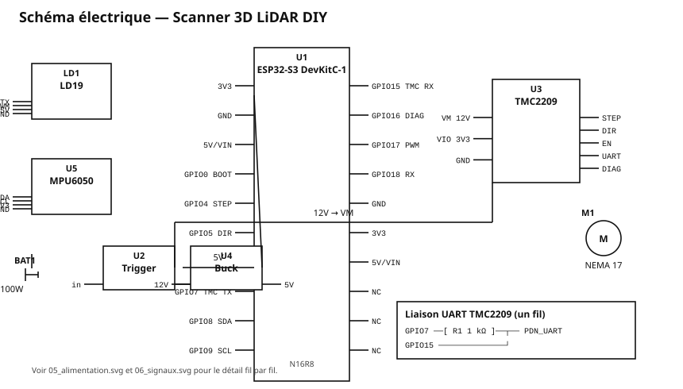
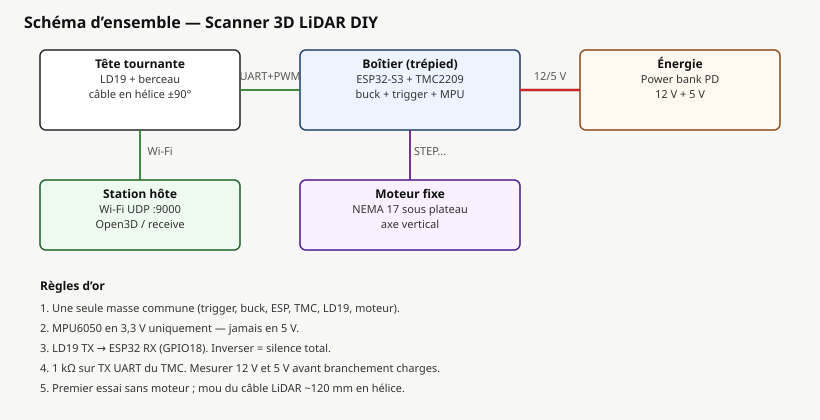
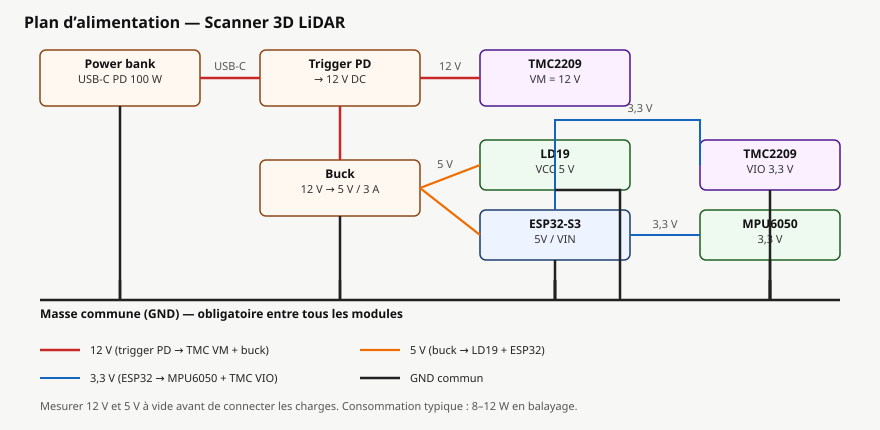
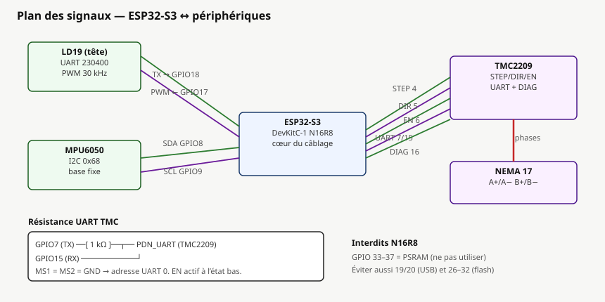
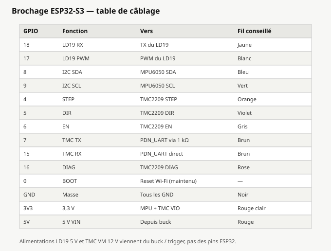
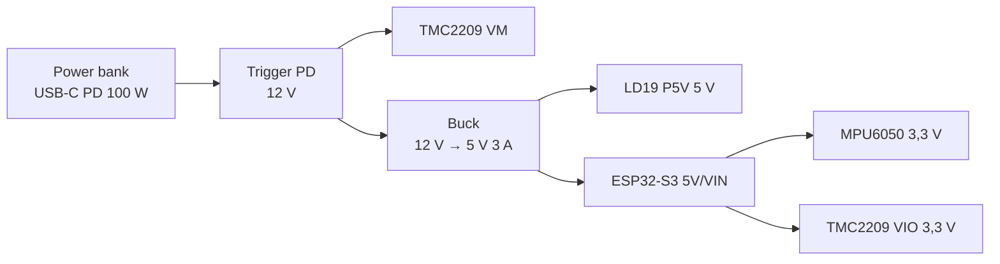
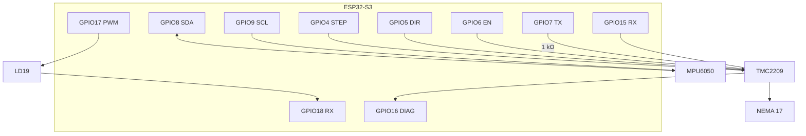

# Câblage et pinout

Plans de câblage du scanner 3D LiDAR (ESP32-S3 N16R8).  
Figures vectorielles dans [`wiring/`](wiring/) :

- plans bloc — [`generate_wiring_svgs.py`](generate_wiring_svgs.py)
- **schémas électriques classiques** — [`generate_schematic_svgs.py`](generate_schematic_svgs.py)

## Schémas électriques (style circuit)

| Schéma | Fichier | Contenu |
|---|---|---|
| Alimentation | [wiring/05_schematic_alimentation.svg](wiring/05_schematic_alimentation.svg) | BAT1, trigger, buck, rails 12 V / 5 V / 3,3 V |
| Signaux | [wiring/06_schematic_signaux.svg](wiring/06_schematic_signaux.svg) | ESP32-S3, LD19, MPU6050, TMC2209, R1 1 kΩ |
| Ensemble | [wiring/07_schematic_ensemble.svg](wiring/07_schematic_ensemble.svg) | Vue d’ensemble compacte |







## Plans bloc (aperçu)

| Plan | Fichier | Contenu |
|---|---|---|
| Ensemble | [wiring/01_ensemble.svg](wiring/01_ensemble.svg) | Tête / boîtier / énergie / hôte |
| Alimentation | [wiring/02_alimentation.svg](wiring/02_alimentation.svg) | 12 V, 5 V, 3,3 V, masse |
| Signaux | [wiring/03_signaux.svg](wiring/03_signaux.svg) | UART, I2C, STEP/DIR/EN, DIAG |
| Brochage | [wiring/04_brochage.svg](wiring/04_brochage.svg) | Table GPIO fil par fil |









---

## 1. Architecture d'alimentation



```
  Power bank USB-C PD 100 W
            │
            ▼
   Module trigger PD  ──► 12 V
            ├──────────────────────► TMC2209  VM
            │
            └──► Buck 12 V → 5 V 3 A
                       ├────────────► LD19        P5V (5 V, vert)
                       └────────────► ESP32-S3    5V / VIN
                                          │
                                          └──3,3 V──► MPU6050
                                                      TMC2209 VIO
```

**Masse commune obligatoire** entre trigger PD, buck, ESP32, TMC2209, moteur et
LiDAR. Une masse flottante sur le TMC2209 est la cause classique de pas perdus
et de comportements erratiques.

Consommation totale : environ 8 à 12 W en balayage.

---

## 2. Brochage de l'ESP32-S3 DevKitC-1 (N16R8)

| Fonction | GPIO | Sens | Fil conseillé | Remarques |
|---|---|---|---|---|
| LiDAR UART RX | 18 | Entrée | Blanc | TX du STL-19P |
| LiDAR PWM | 17 | Sortie | Noir | PWM du STL-19P |
| I2C SDA | 8 | E/S | Bleu | MPU6050 |
| I2C SCL | 9 | Sortie | Vert | MPU6050 |
| TMC STEP | 4 | Sortie | Orange | |
| TMC DIR | 5 | Sortie | Violet | |
| TMC EN | 6 | Sortie | Gris | Actif à l'état bas |
| TMC UART TX | 7 | Sortie | Brun | Via résistance **1 kΩ** → **PDN** (pas USART) |
| TMC UART RX | 15 | Entrée | Brun | Directement sur **PDN** |
| TMC DIAG | 16 | Entrée | Rose | Pastille DIAG (triangle près de RP1) |
| BOOT | 0 | Entrée | — | Reset Wi‑Fi si maintenu au démarrage |
| GND | — | — | Noir | Masse commune |
| 3V3 | — | Sortie | Rouge clair | MPU + TMC VIO |
| 5V / VIN | — | Entrée | Rouge | Depuis le buck |

### Broches à ne pas utiliser

Sur la variante **N16R8**, la PSRAM octale occupe les **GPIO 33 à 37** : les
utiliser fait planter la carte au démarrage. Éviter également les GPIO 26 à 32
(flash SPI) et 19/20 (USB natif).



---

## 3. LiDAR STL-19P (protocole LD19)

Connecteur JST 4 points côté capteur. Brochage identique à la famille LD19.

| STL-19P (ZH1.5T) | Vers | Fil **de cet exemplaire** |
|---|---|---|
| **P5V** | Sortie buck 5 V | **Vert** |
| **GND** | Masse commune | **Jaune** |
| **TX** | GPIO 18 | **Blanc** |
| **PWM** | GPIO 17 | **Noir** |

Le **jaune est la masse**, pas le 5 V. Le **noir est le PWM**, pas la masse.

Le LD19 communique en **UART 230 400 bauds, 8N1**, niveaux 3,3 V, compatibles
directement avec l'ESP32-S3. La liaison est **unidirectionnelle** : le capteur
émet en continu, aucune commande à lui envoyer.

### Commande de vitesse par PWM

Broche PWM à la masse (ou non connectée) : régulation interne à 10 Hz.
Signal carré de 30 kHz appliqué : la vitesse devient réglable de 5 à 13 Hz par
le rapport cyclique, asservie en boucle fermée par le capteur.

Le firmware règle **5 Hz**, ce qui double la résolution angulaire (0,4° au lieu
de 0,8°) sans aucun coût. Voir [geometry.md](geometry.md) § 6.

### Câble tournant

Le câble du LD19 est le seul à traverser la liaison tournante. Sur ±90° de
débattement, une simple boucle de mou suffit : ni bague tournante, ni contact
glissant. Laisser environ 120 mm de mou en hélice lâche le long de la colonne
et fixer les deux extrémités par collier rilsan, jamais en tension.

---

## 4. MPU6050

**Monté sur la base fixe**, pas sur la tête tournante — il ne sert qu'à mesurer
la verticale au repos.

| MPU6050 | ESP32-S3 |
|---|---|
| VCC | 3,3 V |
| GND | GND |
| SDA | GPIO 8 |
| SCL | GPIO 9 |
| AD0 | GND (adresse 0x68) |

Ne **pas** l'alimenter en 5 V : la plupart des cartes GY-521 ont un régulateur,
mais les lignes I2C reviennent alors en 5 V sur l'ESP32.

Le coller à plat dans le boîtier électronique, faces bien parallèles au plateau
de base. Son orientation exacte n'a pas besoin d'être parfaite : la calibration
mesure l'écart une fois pour toutes.

---

## 5. TMC2209 TWOTREES V2.0 et NEMA 17

Module **TWOTREES TMC2209 V2.0** (16 broches, dissipateur au centre, **RP1**
en bas). Orientation : sérigraphie `TWOTREES` en haut, **EN** en bas à droite.

```
        GND    DIR
        VIO    STEP
        M2B    CLK      ← laisser en l'air
        M2A    USART    ← ne pas câbler (UART alternatif)
        M1A    PDN      ← UART (usine)
        M1B    MS2
        GND    MS1
         VM    EN
              RP1  (Vref)
         pastilles triangle : DIAG / INDEX / VREF
```

| Broche module | Connexion |
|---|---|
| VM | 12 V (trigger PD) |
| GND (les deux) | Masse commune |
| VIO | 3,3 V (ESP32) |
| M1A | **A+** noir (BLK) |
| M1B | **A−** bleu (BLU) |
| M2A | **B+** vert (GRN) |
| M2B | **B−** rouge (RED) |
| STEP | GPIO 4 |
| DIR | GPIO 5 |
| EN | GPIO 6 (actif bas) |
| **PDN** | GPIO 15, et GPIO 7 via **1 kΩ** |
| USART | NC — UART usine = **PDN** (4ᵉ broche depuis EN) |
| CLK | NC |
| MS1 / MS2 | GND / GND (adresse UART 0) |
| DIAG (pastille) | GPIO 16 — StallGuard |
| RP1 | Vref (repli si pas d'UART) |

**PDN, pas USART.** Les deux existent sur ce module. L'UART usine est **PDN**
(4ᵉ broche en partant de EN). USART est la 5ᵉ, hors service sans modifier un
strap. Brancher GPIO 7/15 sur USART = driver muet.

**DIAG** n'est pas sur le header 16 broches. Souder un fil sur la pastille
**DIAG** du triangle près de RP1 (les deux autres = INDEX et VREF). Sans ce
fil, le homing StallGuard du firmware ne voit jamais la butée.

### Câble NEMA 17 (4 fils, UL1007 AWG26)

Côté moteur **PHR-6** (broches 2 et 5 vides) ; côté libre 4 fils (ou M20-4).

| Couleur | Signal | PHR-6 | TMC2209 |
|---|---|---|---|
| Noir | A+ | 1 | **M1A** |
| Vert | B+ | 3 | **M2A** |
| Bleu | A− | 4 | **M1B** |
| Rouge | B− | 6 | **M2B** |

Une bobine = une paire : noir+bleu (A), vert+rouge (B). Ne pas mélanger les
paires. Si le sens de rotation est inversé au premier essai, inverser **une**
paire (ex. M1A ↔ M1B) ou inverser DIR dans le firmware — pas les deux.

### Liaison UART à un fil

```
   ESP32 TX (GPIO 7) ──[ 1 kΩ ]──┬── PDN  (TWOTREES TMC2209 V2.0)
                                 │
   ESP32 RX (GPIO 15) ───────────┘
```

La résistance évite le conflit lorsque le driver répond. L'UART ne répond
que si **VM (12 V) et VIO (3,3 V)** sont présents. Sans cette liaison, il
faudrait régler le courant au potentiomètre et renoncer à StallGuard.

L'UART apporte :

1. **Réglage logiciel du courant**
2. **StealthChop2** (balayage silencieux, sans vibration parasite)
3. **StallGuard** (homing sans capteur)

### Courant moteur

Réglage recommandé : **700 mA RMS** par UART. En repli, multimètre :

$$V_{\text{ref}} \approx 1{,}25 \times I_{\text{RMS}} \approx 0{,}88\ \text{V}$$

(avec $R_{\text{sense}} = 0{,}11\ \Omega$ — vérifier sur la carte).

### StallGuard — paramètres de départ

| Registre | Valeur | Rôle |
|---|---|---|
| `TCOOLTHRS` | 0xFFFFF | StallGuard sur toute la plage |
| `SGTHRS` | 60 à 100 | Seuil (partir de 80) |
| Courant homing | 300 mA | Contact doux |
| Vitesse homing | 10 °/s | Minimum pour StallGuard |

---

## 6. Ordre de câblage recommandé

1. **Masses** : relier tous les GND (trigger, buck, ESP, TMC, LD19).  
2. **Mesurer** 12 V (trigger) et 5 V (buck) à vide.  
3. Brancher **5 V** sur ESP32 VIN et LD19 **P5V** (fil vert).  
4. Brancher **3,3 V** sur MPU6050 et TMC VIO.  
5. Signaux LD19 (TX blanc → GPIO 18, PWM noir ← GPIO 17).  
6. I2C MPU (8/9).  
7. TMC STEP/DIR/EN + UART sur **PDN** (1 kΩ) + DIAG (pastille).  
   Ne pas câbler USART ni CLK.  
8. **12 V** sur TMC VM.  
9. Phases moteur en dernier (ou après un premier boot sans moteur).

---

## 7. Contrôle avant première mise sous tension

- [ ] Continuité des masses entre tous les modules
- [ ] Sortie du trigger PD mesurée à 12 V ± 0,5 V, **avant** de la relier
- [ ] Sortie du buck mesurée à 5 V ± 0,2 V, **avant** de la relier
- [ ] MPU6050 alimenté en 3,3 V, pas en 5 V
- [ ] LD19 TX bien vers ESP32 **RX** (erreur la plus fréquente)
- [ ] Résistance de 1 kΩ en place sur la ligne TX du TMC2209
- [ ] Courant du TMC2209 réglé bas avant le premier mouvement
- [ ] Câble du LiDAR avec du mou, libre sur ±90°
- [ ] Rien ne frotte lorsqu'on fait tourner la tête à la main

Premier démarrage : brancher **sans le moteur**, vérifier que le LD19 émet et
que le Wi-Fi monte, puis seulement connecter le moteur.

Voir aussi [build.md](build.md) étape 5 et [assembly.md](assembly.md).
